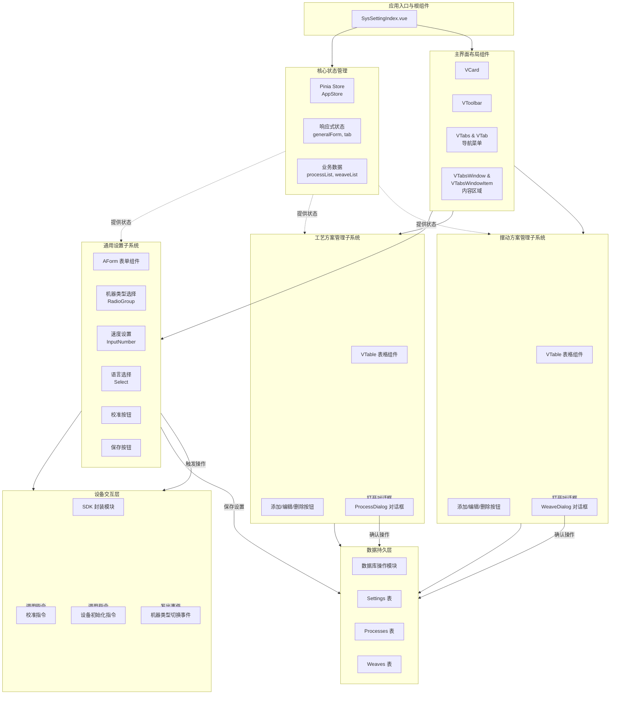

```mermaid
flowchart TD
    subgraph A [应用入口与根组件]
        A1[SysSettingIndex.vue]
    end

    subgraph B [核心状态管理]
        B1[Pinia Store<br>AppStore]
        B2[响应式状态<br>generalForm, tab]
        B3[业务数据<br>processList, weaveList]
    end

    subgraph C [主界面布局组件]
        C1[VCard]
        C2[VToolbar]
        C3[VTabs & VTab<br>导航菜单]
        C4[VTabsWindow &<br>VTabsWindowItem<br>内容区域]
    end

    subgraph D [通用设置子系统]
        D1[AForm 表单组件]
        D2[机器类型选择<br>RadioGroup]
        D3[速度设置<br>InputNumber]
        D4[语言选择<br>Select]
        D5[校准按钮]
        D6[保存按钮]
    end

    subgraph E [工艺方案管理子系统]
        E1[VTable 表格组件]
        E2[添加/编辑/删除按钮]
        E3[ProcessDialog 对话框]
    end

    subgraph F [摆动方案管理子系统]
        F1[VTable 表格组件]
        F2[添加/编辑/删除按钮]
        F3[WeaveDialog 对话框]
    end

    subgraph G [设备交互层]
        G1[SDK 封装模块]
        G2[校准指令]
        G3[设备初始化指令]
        G4[机器类型切换事件]
    end

    subgraph H [数据持久层]
        H1[数据库操作模块]
        H2[Settings 表]
        H3[Processes 表]
        H4[Weaves 表]
    end

    A1 --> B
    A1 --> C
    C --> D
    C --> E
    C --> F
    
    D --> G
    E --> H
    F --> H
    
    B -.->|提供状态| D
    B -.->|提供状态| E
    B -.->|提供状态| F
    
    D -->|保存设置| H
    D -->|触发操作| G
    
    E -->|打开对话框| E3
    F -->|打开对话框| F3
    
    E3 -->|确认操作| H
    F3 -->|确认操作| H
    
    G -->|调用指令| G2
    G -->|调用指令| G3
    G -->|发出事件| G4
```