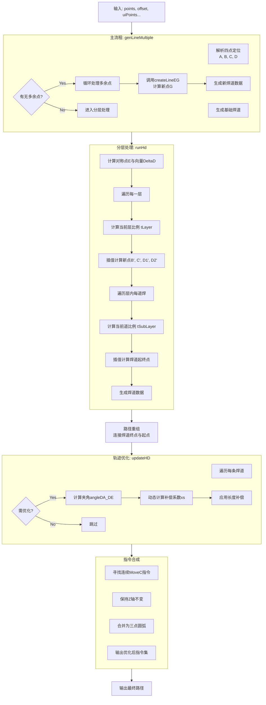

```mermaid
flowchart TD
    A[输入: points, offset, uiPoints...] --> B(genLineMultiple)
    
    subgraph B [主流程: genLineMultiple]
        B1[解析四点定位<br>A, B, C, D]
        B2[生成基础焊道]
        B3{有无多余点?}
        B3 -- Yes --> B4[循环处理多余点]
        B4 --> B5[调用createLineEG<br>计算新点G]
        B5 --> B6[生成新焊道数据]
        B3 -- No --> B7[进入分层处理]
    end
    
    B --> C(runHd)
    
    subgraph C [分层处理: runHd]
        direction TB
        
        C1[计算对称点E与向量DeltaD]
        C2[遍历每一层]
        C2_C1[计算当前层比例 tLayer]
        C2_C2[插值计算新点B', C', D1', D2']
        C2_C3[遍历层内每道焊]
        C2_C3_C1[计算当前道比例 tSubLayer]
        C2_C3_C2[插值计算焊道起终点]
        C2_C3_C3[生成焊道数据]
        
        C1 --> C2
        C2 --> C2_C1
        C2_C1 --> C2_C2
        C2_C2 --> C2_C3
        C2_C3 --> C2_C3_C1
        C2_C3_C1 --> C2_C3_C2
        C2_C3_C2 --> C2_C3_C3
    end
    
    
    C --> D[路径重组<br>连接焊道终点与起点]
    D --> E(updateHD)
    
    subgraph E [轨迹优化: updateHD]
        E1[遍历每条焊道]
        E2{需优化?}
        E2 -- Yes --> E3[计算夹角angleDA_DE]
        E3 --> E4[动态计算补偿系数xs]
        E4 --> E5[应用长度补偿]
        E2 -- No --> E6[跳过]
    end
    
    E --> F(mergeMoveCInOrder)
    
    subgraph F [指令合成]
        F1[寻找连续MoveC指令]
        F2[保持Z轴不变]
        F3[合并为三点圆弧]
        F4[输出优化后指令集]
    end
    
    F --> G[输出最终路径]

```